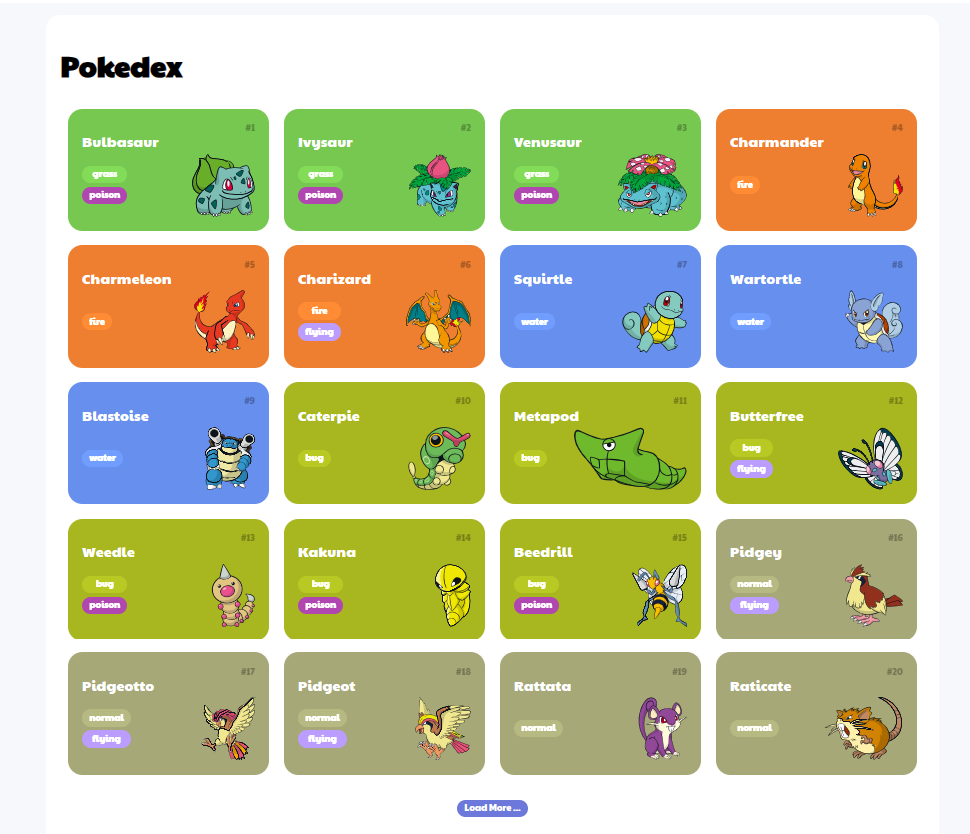

<h1>Pokedex</h1>

 Exercício de Javascript com HTML e CSS puros, para treino.

Como base de dados, foi utilizada a API pública PokeAPI (https://pokeapi.co/api/v2/pokemon) para exibição de pokemons em listagem de cards.

